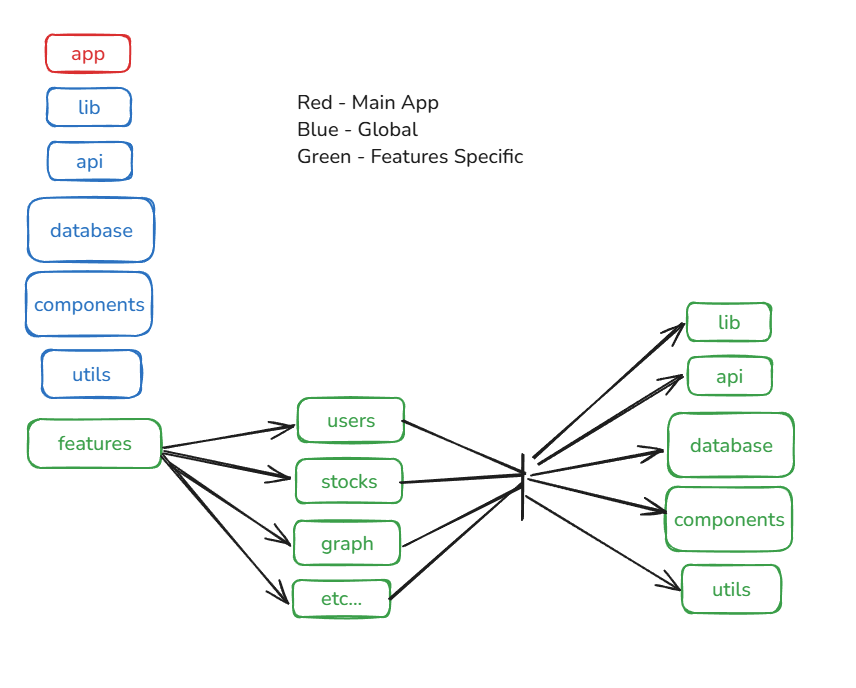
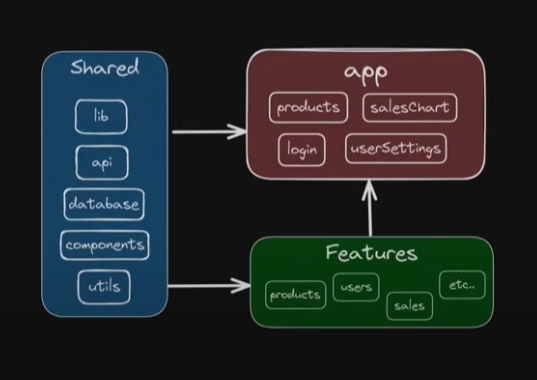

# Stock Tracker

The Stock Tracker project allows users to track the price of stocks by entering their symbols. It provides a visual representation of stock price changes over time and offers cost estimations for future prices.

## Features

- Track stock prices by entering the stock symbol.
- View visual graphs showing stock price trends.
- Estimate future stock prices based on historical data.
- Automatically track the gap between the last tracking date and the current date.
- Store tracked stock data locally for future reference.
- By default, stocks are checked against the TSX, unless a different exchange is specified.

## Setup

To set up the project, follow these steps:

1. Clone the repository.
2. Run `npm install`.
3. Run `npm run dev`.

## File Structure

## Data Flow

Arrows indicate access permissions. For example, features can access shared utilities, but features cannot access components in the app folder.

# Notes for frontend
- Create buttons to select 30,60,90,180 etc.... maybe custom text box?
- Add linear regression line
- Add meta Data stats to additonal table